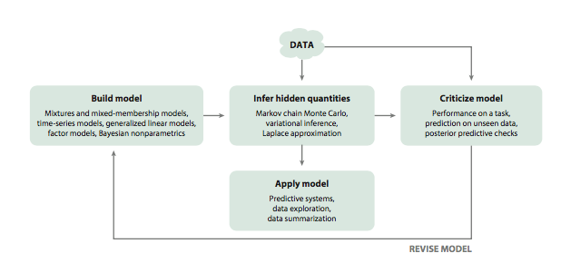

In the 1960's, the great statistician Box, along with his collaborators, formulated the notion of a loop to understand the nature of the scientific method. This loop is called Box's loop by Blei et. al., [^1], and illustrated in the diagram (taken from the above linked paper) below:

Box himself focussed on the scientific method, but the loop is applicable at large to other examples of probabilistic modelling, such as the building of an information retrieval or recommendation system, exploratory data analysis, etc, etc

We:

1. first build a model. This is as much as an art as a science if we are of the philosophical bent that we desire explainability. We bring in domain experts.
2. We compute a model using the observed data.
3. We then critique our model, studying how they succeed or fail and how they predict future data or on held out sets.
4. If we are satisfied with the performance of our model we apply it in the context of a predictive or explanatory system. If we are not, we go back to 1.

If we are **Bayesians**, we compute the *posterior* distribution (the distribution of the parameters conditioned on the data) of the (hidden) parameters of the model. Here we assume that the data is fixed and our stochasticity is in the parameters.

If we are **Frequentists**, we assume our data is a sample from a population and compute the parameters of our models abd confidence intervals for those parameters. Here we assume that the data is stochastic as in we could get multiple different samplkes, but that the parameter is fixed and given.

We could have mis-specified our model. It might be too simple or too complex. If so we go back to (1) and try again with another model specification.

[^1]: Blei, David M. "Build, compute, critique, repeat: Data analysis with latent variable models." *Annual Review of Statistics and Its Application* 1 (2014): 203-232.